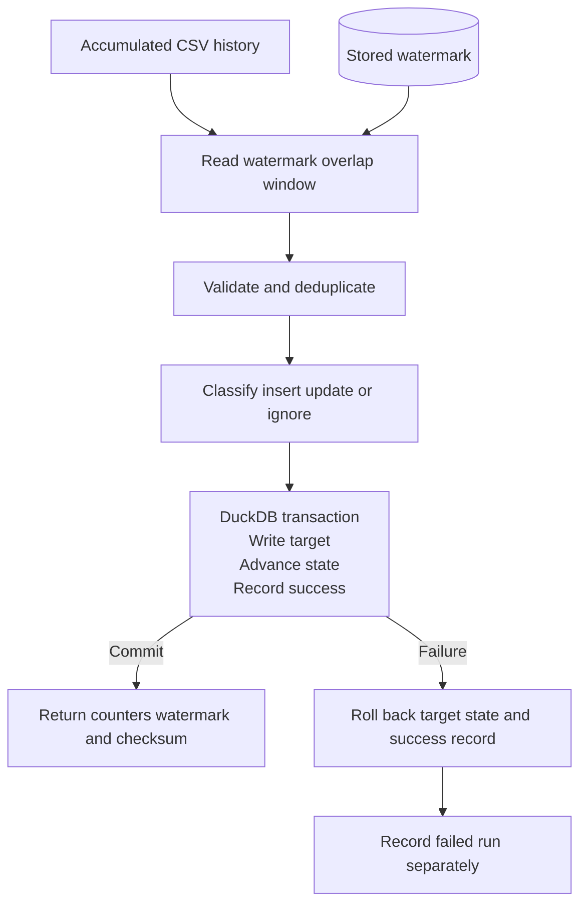

# Reliable Incremental Processing Pattern

An idempotent, retry safe incremental data pipeline built with Python and DuckDB.

This project explores a common problem with incremental pipelines: what happens if a job writes its target data but crashes before updating its watermark?

If the job runs again, it may process records it has already handled. This pipeline avoids duplicate or unnecessary updates by using record version checks and committing target changes, watermark updates and successful run metadata in a single DuckDB transaction. If the transaction fails, everything rolls back and the same command can be retried.

## How it works



Each run reads source history starting from the stored watermark minus a configurable overlap. This allows the pipeline to pick up late arriving records while safely reprocessing records it has already seen.

Records are ordered using `(updated_at, source_sequence)`, so deciding which version is newer doesn't depend on its position in the CSV. Exact duplicates are collapsed, while conflicting records with the same product and version cause the run to fail before mutation.

Target version checks prevent stale records from overwriting newer data or unnecessarily updating existing rows.

DuckDB stores the target data, watermark and run history. Successful target changes, watermark advancement and successful run metadata commit together. Failed runs are recorded separately.

## Getting started

The project uses Python 3.13.

```powershell
git clone https://github.com/davidom0101/incremental-processing-pattern.git
cd incremental-processing-pattern

py -3.13 -m venv .venv
.\.venv\Scripts\Activate.ps1

python -m pip install -e ".[dev]"
```

Run the initial load:

```powershell
incremental-processing --source examples/source/products_initial.csv --database products.duckdb --initial-start-at 2026-01-01T00:00:00Z
```

Successful runs return exit code `0` and print processing counters, timestamps, the watermark and a business state checksum as JSON.

Failures return exit code `1` and retain a separate failed-run audit record.

There is no special retry mode. Run the same command again against the same accumulated source history.

## Failure and recovery demo

The demo walks through six runs, including an intentionally injected failure after the target writes but before the transaction commits.

```powershell
python examples/run_demo.py
```

| Run | Scenario | Result |
|---|---|---|
| 1 | Initial load | Five inserts |
| 2 | Exact replay | No target changes |
| 3 | Updates | Two updates |
| 4 | Mixed input | Inserts, update, stale row and duplicate handled |
| 5 | Injected failure | Target and watermark rolled back |
| 6 | Retry | Pending changes committed once |

Runs 5 and 6 demonstrate the main recovery behaviour.

The injected failure occurs after target writes but before watermark advancement or successful run metadata insertion. DuckDB rolls back the target changes, while the watermark and successful run metadata remain unchanged.

The next run processes the same history and commits the pending changes without manual repair.

The recovery tests also verify that a clean execution and a failed execution followed by a successful retry produce the same business state.

## Tests

Run the test suite:

```powershell
ruff format --check .
ruff check .
mypy
pytest
```

The main tests check that:

- Replaying source history leaves existing target rows unchanged.
- Duplicate, stale, late arriving and conflicting records are handled correctly.
- Failed transactions roll back without advancing the watermark, and retries produce the same business state as clean runs.

Additional tests cover equal timestamps, empty windows, future timestamps, processing counters, failed run audit records and CLI exit behaviour.

A canonical SHA-256 checksum is used to compare logical business state. Replay tests also compare complete target rows to catch unwanted metadata updates.

## Limitations

Version 1 assumes one active writer per `pipeline_name`. Late arriving records are only guaranteed to be discovered within the configured overlap window.

The project focuses on single writer, retry safe batch processing. It does not provide distributed exactly once delivery.

Deletes, streaming, schema evolution, distributed transactions, additional database backends and cloud orchestration are outside its current scope.
